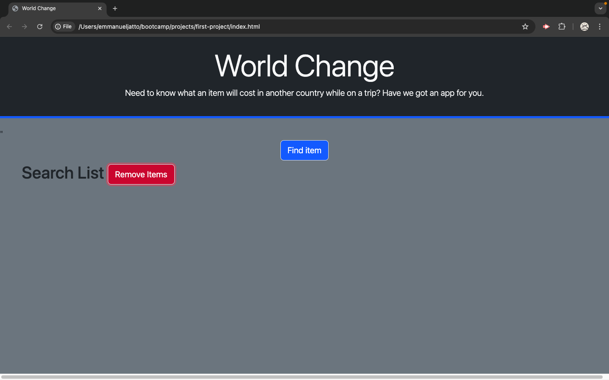
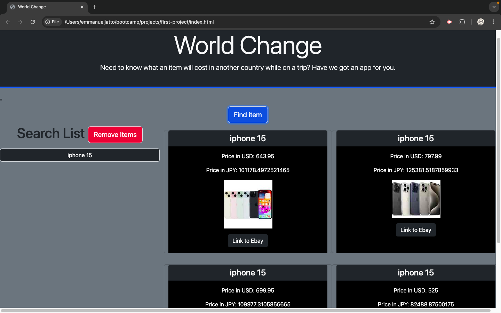

# first-project
Application Name: World Change

This application will be used to find an item on Ebay list and save the item to the local storage while converting the currency type from United States dollars into Euros, Canadian dollars, Australian dollars, Mexican pesos or yen.

When you search an item and select a currency type it will automatically appear on the screen with a picture of the item a name and the USD amount converted to the selected type of currency.

The styling of the website is designed to be dark so there are no issues with a bright screen as well as to be simple and easy to use.

We used jquery to simplify our script code and we used bootstrap for our styling to keep from having to have a separate css file.

[World Change Website Link](https://zeketinch.github.io/first-project/)

[Github Link](https://github.com/ZekeTinch/first-project)

[Excalidraw URL](https://excalidraw.com/#room=758c805324c4b8d89b3a,z_k1yVY6ADra1HVRPWaz4g)

[Ebay Api URL](https://rapidapi.com/felixeschmittfes/api/ebay32)

[Currency Converter Api URL](https://rapidapi.com/Dezento/api/currency-converter-pro1)